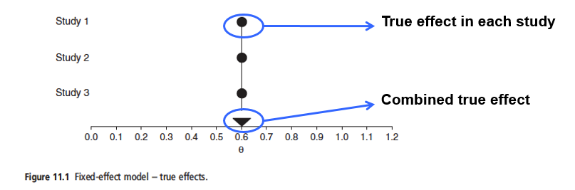
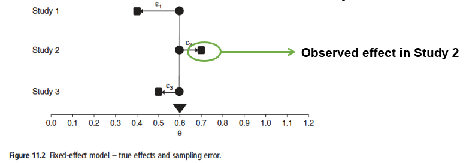
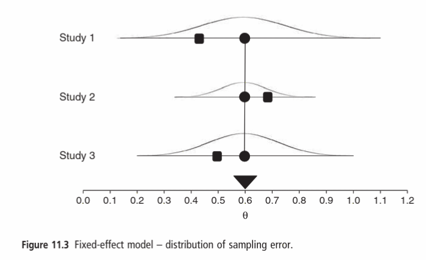
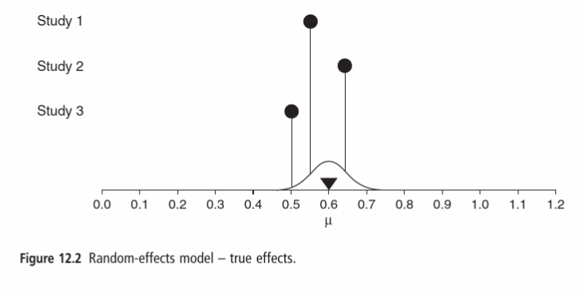
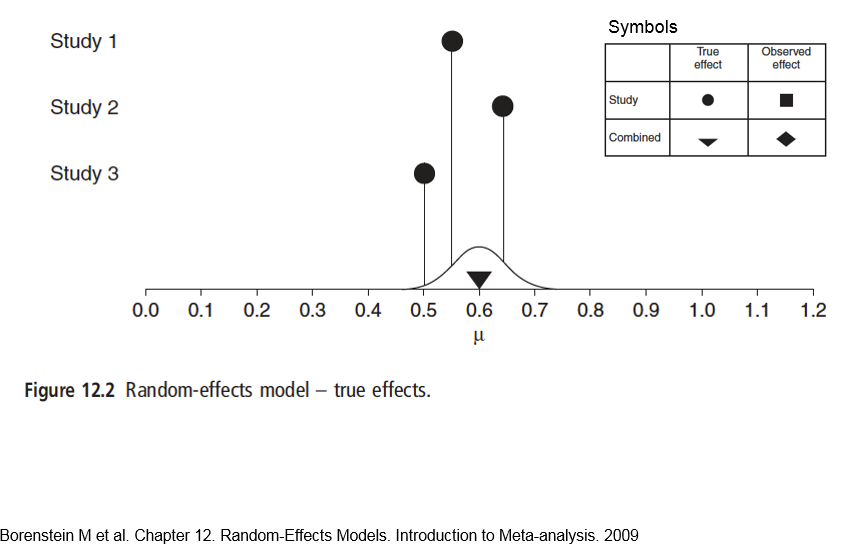
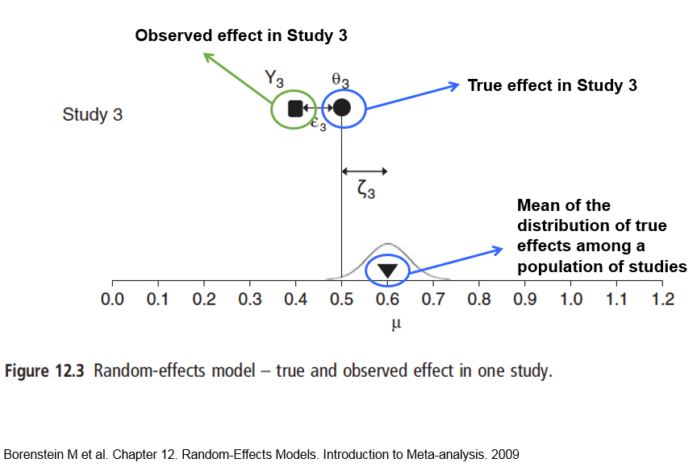
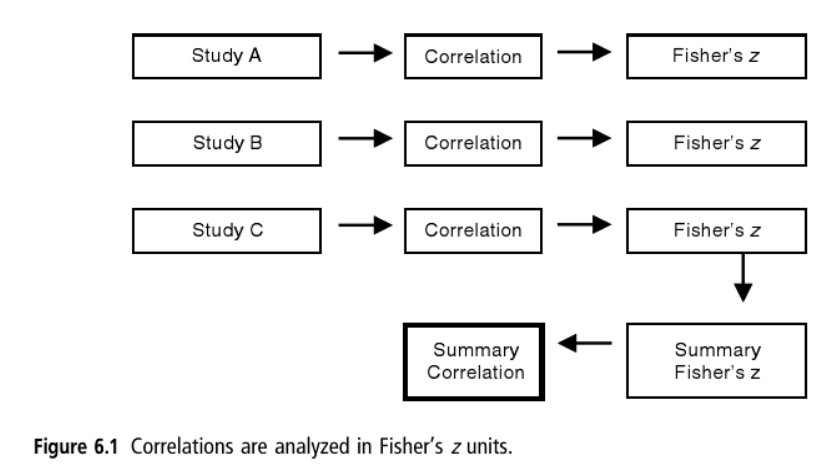

```{r setup, include=FALSE}
library(metafor)
continuous_dat <- read.csv("metafor/www/Borenstein_p88.csv")
binary_dat     <- read.csv("metafor/www/Borenstein_p93.csv")
corr_dat       <- read.csv("metafor/www/Borenstein_p98.csv")
knitr::opts_chunk$set(echo = TRUE, warning = FALSE, message=FALSE)
```

# Introduction
In this practical you are going to undertake some basic meta-analyses, using data from _Borenstein et al. (2009) Introduction to meta-analysis._ Many of its examples are medical, rather than ecological, but it gives an exceptionally clear explanation of the underlying theory behind meta-analysis, included fixed- and random-effects. You are recommended to look at [this interactive website](https://naturalandenvironmentalscience.shinyapps.io/metafor/) before trying this practical, as it demonstrates the use of many of the same techniques and data.  We will use three datasets from the book:

* a continuous set of data, with means and sds for treatment and control. These are the types of data you might obtain from studies comparing different environmental management or treatment regimes, sometimes as part of a planned experiment, but more usually a 'natural experiment' depending on the ecology of the set.

* binary data, also known as dichotomous or frequency data. These types of data are often encountered in ecological surveys, for example whether an animal is 'dead' vs 'alive' or 'present' / 'absent'

* a dataset with a set of correlations. In ecology you might find these types of data where one variable is biodiversity, and another continuous variable migh be an environmental measure such as elevation or soil pH.

We will use the excellent `metafor` package to automate the analyses. As usual with R, the manual pages can be rather cryptic to understand, but fortunately there is an excellent website for the package at <http://www.metafor-project.org/doku.php/metafor>, and a journal article at <https://www.jstatsoft.org/article/view/v036i03>. 

Before you begin, if you have not already done so, you need to install and load the `metafor` package. You only need to install a package once, but must load it with the `library()` function every time you use it.

```{r, eval=FALSE}
install.packages("metafor") # only needed once
library(metafor)            # needed at the start of every R session
```

If you want the most up-to-date development version of `metafor`, you can install this, although you will probably need the RTools 4 programme [https://cran.r-project.org/bin/windows/Rtools/](https://cran.r-project.org/bin/windows/Rtools/) installed if you have a Windows PC. The development version gives you access to a few extra refinements, but is **not** essential to complete BIO8075.

```{r, eval=FALSE}
# Only if you want the development package (optional)
install.packages("remotes")
remotes::install_github("wviechtb/metafor")
library(metafor)
```

The main overall aims of this practical are to remind you of fixed- and random-effects models, and repeat some of the calculations basic fixed-effects and meta-analyses that you did manually in Practical 3 using `metafor`. We will expand this to binary and correlation data, and explore how to test the quality of your meta-analysis models in terms of the underlying assumptions. Specific objectives are to:

1. Meta-analysis of continuous data
2. Meta-analysis of count or binary data
3. Meta-analysis of correlation data
4. Test model assumptions

There are three datasets to download from Canvas, all CSV format files. You will probably find it easiest to save them in the same folder as your R script, or a sub-folder called `Data`.

# 1. Meta-analysis of continuous data
## 1.1 Fixed-effects
Recall that data can be analysed by [either fixed- or random-effects](https://naturalandenvironmentalscience.shinyapps.io/Further_Effects/#section-fixed--vs-random-effects) meta-analysis, and the approach and philosophy differs slightly. The following diagram summarises a fixed-effect model

{Width=75%}

In the above diagram our effect size is represented by $\theta$ (Greek letter theta), with our true overall effect across all studies the triangle at the bottom. The basic assumption of a fixed-effect model is that every study would have this same true effect, as shown by the circles lined up vertically.

Since all the studies have the **same** true effect, any variation that they report must be due to random error inherent in each study. If you had infinite sample sizes, they would all report the same true effect; they would be showing the population-based effect size. See [populations and samples](https://naturalandenvironmentalscience.shinyapps.io/Effectsizes/#section-populations-and-samples). This is summarised below:

{Width=75%}

Of course, in reality the sample size in each study is not infinite, so you get sampling variation. In the diagram below the true effect for each study (circles) is still the same, but the observed effect (squares) now varies:

{Width=75%}

So we can say the observed effect $Y$ for study $i$ is:

$$Y_i=\theta+\epsilon_i$$

At first sight, these errors shown as $\epsilon_1, \epsilon_2, \epsilon_3$ (Greek letter epsilon) for the three studies is problemmatic. However, we can estimate the **sampling distribution** around these errors, placing a normal (Gaussian or 'bell-shaped') curve around each error, based on the reported variance in the study.

{Width=75%}

Study 1 has a relatively small sample size, with large variance, so the observed effect could have fallen roughly between 0.20 and 1.00. In contrast, Study 3 has a large sample size, with small variance, and so the observed effect is roughly between 0.40 to 0.80. A normal curve is based on the square root of the variance.

In a fixed effect analysis, all the studies are assumed to have the same 'true' effect, and all the factors that could influence the effect size are the same in all the studies. However, there is still sampling error, which is reflected in the different results for each study  The study weights are assigned as the inverse of the variance of each study. A the key point with a fixed-effect model is that the observed effect $Y_i$ for any given study $i$ is:

$$Y_i = \theta + \epsilon_i$$
where $\theta$ (Greek letter _theta_) is the overall "population" mean and $\epsilon_i$ (Greek letter _epsilon_) is the sampling error (which might be positive or negative)

## 1.2. Example of continuous dataset
This is a dataset of 6 studies, stored in an Excel file (CSV format). The raw data are taken from page 88 of Borenstein.  First read in and display the data:

```{r, eval=FALSE}
# Continuous data
# Remember to ensure that your R session is looking in the right place to find
# the CSV file. If you have stored it in a sub-folder called Data, then change
# the next line to
# continuous_dat <- read.csv("Data/Borenstein_p88.csv")
continuous_dat <- read.csv("Borenstein_p88.csv")

continuous_dat
```

You can see that the format of the data is fairly simple, with the means, SD and number of samples shown for thre Treatment (T) and Control (C) of each study. The sudy by Peck has relatively few samples (40 in T and C) and so will be given a lower weight in the meta-analysis, whilst that of Donat has 200 per treatment, and so will receive a high weight.

## 1.3 Hedges' _g_ of continuous data
We begin by calculating the effect size, and will use the bias-corrected standardised mean difference (Hedges' _g_) as our measure. Recall that it corrects a simple standardised mean difference (Cohens' _d_) for biases from studies with small sample sizes. **Note**: The effect size calculations are the same irrespective of whether we subsequently perform a fixed- or random-effects meta-analysis. We calculate the effect sizes with the `escalc()` function, the effect size calculator, which takes variable numbers of 'arguments' depending on whether you have continuous, count or correlation data.

* `measure`. This is the effect size to calculate. `"SMD"` indicates bias-corrected standardised mean differences (Hedges' _g_)
* `m1i`, `m2i`. The means for the two treatments
* `sd1i`, `sd2i`. The standard deviations
* `n1i`, `n2i`. The number of replicates
* `data`. The name of the data.frame `continuous_dat`; each row is a separate study.

```{r fixed_effect_size}
continuous_eff <- escalc(measure="SMD", m1i=T_mean, sd1i=T_SD, n1i=T_n,
                         m2i=C_mean, sd2i=C_SD, n2i=C_n, data=continuous_dat)

continuous_eff
summary(continuous_eff) # Output format simplified
```

In the output summary, the column headed `yi` contains the Hedges' _g_ standardised effect sizes, and the column `vi` their within-variance. Also output are standard errors, z test statistics and the lower and upper 95% confidence intervals.

## 1.4 Fixed-effect analysis of continuous data
Now you can complete the fixed-effect meta-analysis via the `rma` command. Typically the `rma` function requires a minimum of 3 arguments (e.g. `yi`, `vi` and `data`) but here we provide it with four arguments:

* `yi` The effect size. We are using Hedges' _g_ here, but the `rma` function always assumes that `yi` is your effect size.
* `vi` Within-study variance
* `data` The dataframe with the effect sizes and variances. There is nothing wrong if in the `escalc` call you decide to "overwrite" your original dataframe; it will keep all the existing columns, and add the new ones to it.
* `method`. By default `rma` doesnot do fixed-effects models, so we have to specify it here.

```{r fixed_effect_rma}
continuous_fixed_rma <- rma(yi, vi, data=continuous_eff, method="FE")
summary(continuous_fixed_rma)

```

This shows the standardised mean difference (Hedges _g_) of 0.4150021 under the estimate heading, the same as the value of M that you manually calculated in the previous practical. It also shows the standard error, the z-statistic, p-value and 95% CI. Here the meta-analysis is indicating a significant difference between the treatment and control for the reported standardised effect size.

Finally, you can summarise all these results via a ‘forest plot’; we will use the `showweights` option to display them:

```{r fixed_forest}
forest(continuous_fixed_rma, showweights = TRUE)
```

The standard output shows the effect size at the end, and the 95% CI for each study as well as for the overall fixed-effects (FE) model. By default, the forest plot merely lists the studies as ‘Study 1’, ‘Study 2’ etc., but later you will learn R commands to improve the plots.

## 1.5 Random-effects
One problem with the fixed-effect method is that it assumes that all the studies are identical, and that the real effect size is the same in all the studies. Of course in reality this is unlikely to be true. The underlying effect sizes are likely to differ. So our underlying true effects will differ for each study, forming a bell-shaped curve around our overall true effect across all studies:

{Width=75%}

In the above diagram $\mu$ (Greek letter mu) effect size, and the triangle represents the overall true effect across all studies. The actual true effect at three studies within this bell-shaped curve are represented by circles.

For example, survival of an endangered mammal population as a result of a management intervention may partly depend on the age of the mammals in the different populations in each of the different studies, as well as the actual management intervention. The diagram below shows the true effect sizes (0.55, 0.65 and 0.50) in three studies, assuming no observation error whatsoever, $\delta_1$, $\delta_2$ and $\delta_3$. The curve represents the normal distribution around all true effects.

{Width=75%}

Of course in reality, there is observation error, so for our third study there is both the sampling error, shown as $\epsilon_3$ below which is the difference of what was observed, $Y_3$ and the true effect size $\delta_3$ in that study. The study effect size differs from the overall effect size for all studies by $\zeta_3$ as shown below:

{Width=75%}

So, we can say that the observed effect $Y_i$ for any study is given by the grand mean $\mu$ (Greek letter _mu_), the deviation of the study's true effect from the grand mean $\zeta_i$ (Greek letter _zeta_), and the sampling error in that study $\epsilon_i$ (Greek letter _epsilon_):

$$Y_i = \mu + \zeta_i + \epsilon_i$$
This equation covers both within-study variation $\epsilon_i$ and between-study variation $\zeta_i$. Hopefully you can see that **random-effects models are generally preferred** over fixed-effects models in meta-analysis as they give a more realistic reflection of the processes actually taking place.

## 1.6 Random-effects analysis of continous data
The `metafor` package defaults to random models when possible, as they are usually more robust for the reasons explained above. Repeating our analysis as before. There is no difference in the calculation of the Hedges' _g_ effect sizes, so we can use the ones from earlier:

```{r continuous_random_rma}
continuous_random_rma <- rma(yi, vi, data=continuous_eff)
summary(continuous_random_rma)

```

Notice that our estimate of the standardised effect size, 0.3606525 is smaller than that obtained via the fixed-effect model of 0.4150021, but is still significant. Again we can produce a forest plot to summarise your findings:

```{r random_forest}
forest(continuous_random_rma, showweights = TRUE)

```

Note how the weighting for Study 4 has gone down compared to the fixed-effect model. It has been downweighted as its reported effect size was so different from all the other studies.

## 1.7 Other approaches to continous data
In addition to Cohens' _d_ and Hedges' _g_, another common method of meta-analysis of continuous data is through **response ratios**. As with most ratio data, these are analysed as logarithms, to maintain symmetry around the central point of both treatments (interventions) being the same. Have a look at [this interactive BIO8075](https://naturalandenvironmentalscience.shinyapps.io/metafor/#section-random-effect-meta-analysis-continuous-data) website for an example of analysing these data using response ratios.


# 2. Meta-analysis of binary data
## 2.1 Example of binary dataset
Often studies will report binary data, such as ‘dead’ or ‘alive’, ‘present’ or ‘absent’ etc. in ecological and conservation surveys. These are generally analysed as ‘odds ratios’ although metafor can handle ‘risk ratios’ etc. should you wish to use them.

Again these data are taken from Borenstein (page 93) so if you want to do all the calculations by hand you can see the fully-worked out examples. The dataset is available on Canvas as `Borenstein_p93.csv`; please download it, and import it into R using the `read.csv()` function, storing it in a dataframe called `binary_dat`. Look at the data:

```{r, echo=FALSE}
print(binary_dat)
```

The 'E' represent 'Events' and the 'NE' represent 'Non-events' for the Treatment (T) and Control (C), whilst 'n' is the number of observations in the treatment or control of each study.

## 2.2 Odds ratio of binary data
Again we will begin by calculating the effect size. Several different measures can be used with binary data, and here we show **odds ratios**. The odds ratio is calculated as:

$$OddsRatio = \frac{TreatmentOdds}{ControlOdds}$$

so for the first study, by Saint, this can be calculated as:

$$OddsRatio_1 = \frac{12 \times 14}{53 \times 16} =0.6934$$

Again, the calculations of effect sizes are actually done on the natural logarithm of the effect sizes, to maintain symmetry, i.e. 

$$logOddsRatio=ln(OddsRatio)$$

so if you want to look at the odds ratio in the original units you have to back-transform via the exponential function. Calculation of the effect sizes is again done using the `escalc()` function, but as we are dealing with binary (count) data, the arguments we present are slightly different. As before, the effect size calculation is the same irrespective of whether you subsequently do a fixed- or random-effects model. We provide `escalc()` with six arguments:

* `measure` which is `"OR"` for odds ratio
* `ai` = the number of "events" in the treatment
* `bi` = the number of "non-events" in the treatment
* `ci` = the number of "events" in the control
* `di` = the number of "non-events" in the control
* `data` which is the dataframe, one row per study.

You might be puzzled why the arguments have the `a, b, c, d` prefixes. This is because often when you read a paper that includes such data, it will be shown in a table such as:

| | Events | Non-events |
|:-:|:----:|:----------:|
| Treatment | A | B |
| Control | C | D |

In an ecological context, your Events might be 'extinction' and non-events 'still present' for an endangered species at 2 sites with different management regimes.

```{r binary_fixed_effect_sizes}
binary_eff <- escalc(measure="OR", ai=E_T, bi=NE_T, ci=E_C, di=NE_C,
                     data=binary_dat)

# Show the effect size in column yi in log-transformed and original units
summary(binary_eff)
summary(binary_eff, transf=exp)
```

The summary results are shown twice here. First the odds ratios (yi column) are by default shown in natural logarithms (ln). To display in their original units we need to anti-log them, which for natural logarithms is via exponential function. You will see the odds ratio for the Saint study displayed as 0.6934 which is the same as obtained manually.

## 2.3 Fixed-effects analysis of binary data
By default on binary data `metafor` uses random-effects as that gives better results and is to be preferred. However, we will initially do a simple fixed-effect model for which we must specify that `method="FE"` as one of the options. By default for odds ratios the forest plot are shown in log scale, so back-transform (compare this plot with Fig. 14.3 of Borenstein)

```{r binary_fixed}
binary_fixed_rma <- rma(yi, vi, data=binary_eff, method="FE")
summary(binary_fixed_rma) # use transf=exp for original units

forest(binary_fixed_rma, atransf=exp, showweights = TRUE)
```

The summary table gives the estimate of the effect size as -0.7241 which is the log odds ratio. To convert it back to the original odds ratio (OR) scale take its exponential using the `exp` function to get 0.4847

## 2.4 Random-effects analysis of binary data
As already emphasised, in general it is better to use random effects models in meta-analysis. However, note that this is not universally applicable to all situations: see Chapter 13, especially Page 83, of Borenstein for a good comparison of the pros and cons of each approach.

You have already calculated the effect size (odds ratios) so it is straightforward to undertake the meta-analysis. As usual, the `rma()` function defaults to random effects, so there is no need to include a `method` argument.

```{r binary_random}
binary_random_rma <- rma(yi, vi, data=binary_eff)

summary(binary_random_rma)
forest(binary_random_rma, atransf=exp, showweights = TRUE)

```

Compare the two forest plots for the fixed vs random effects: here you can see that by taking the random differences between the studies into account, that the effect size is slightly larger 0.56 in the RE than the 0.48 in the FE study.

## 2.5 Other approaches to binary data
Two other effect sizes often used with binary data are **risk differences** and **risk ratios**. The latter are particularly popular, partly as they are more intuitive to understand than odds ratios. The `escalc()` function can be used to calculate both measures, and you might find it useful to [look at this BIO8075 website page](https://naturalandenvironmentalscience.shinyapps.io/metafor/#section-random-effect-meta-analysis-binary-data) to see an example of risk ratios applied to this same dataset.

# 3. Meta-analysis of correlation data
## 3.2 Example of correlation dataset
Again we will use one of the example datasets from Borenstein, discussed on page 98, which also shows the whole analysis done step-by-step if you wish to gain greater insights. Download the file `Borenstein_p98.csv` from Canvas, and import it into a dataframe called `corr_dat`. Look at the data; each row is a separate study, and there are two columns, one containing the correlation coefficient, the other the number of replicates.

```{r display_corr, echo=FALSE}
print(corr_dat)
```


## 3.2 Fisher's z-scores
Most ecologists are very familiar with correlation, as it is a relatively simple statistic, widely reported. The "population" correlation is usually represented by the Greek letter $\rho$ (Greek letter _rho_) whilst the "sample" correlation, that is what is actually reported in any study, is indicated via _r_.   However, in meta-analysis the correlation coefficients _r_ are usually converted to Fisher's _z_ scale (the terminology is a little confusing, as this is not the same as the _z_ values used in some statistics tests). The values are then back-converted to the original _r_ values for final presentation of the meta-analysis results. The process is shown schematically below:

{Width=75%}

and Fisher's _z_ scale values can be calculated as:

$$z=0.5 \times \ln\bigg(\frac{1+r}{1-r}\bigg)$$

and the back-transformation to the original correlation units is:

$$r=\frac{e^{2z}-1}{e^{2z}+1}$$

Let's focus initially on the second study by Newman, which has a correlation coefficient of 0.6, and 90 replicates. To calculate Fisher's _z_ transformed value for this study, we simply need to calculate:

$$z_1 = 0.5 \times \ln\bigg(\frac{1+0.60}{1-0.60}\bigg)$$

which can be calculated in R; note that in R the function "`log`" is for natural logs, whereas the function "`log10`" is for logs to base-10:

```{r z_value_Newman}
# We use [2] to indicate the second row
z_Newman <- 0.5 * log((1+corr_dat$Correlation[2])/(1-corr_dat$Correlation[2]))

z_Newman
```

As usual, we can calculate the effect size, as measured by Fisher's _z_ scores for all the studies using the `escalc()` function from `metafor`. The inputs are:

* `ri` The correlation coefficient in each study
* `ni` the number of samples in the study
* `data` The dataframe containing the correlation dataset
* `measure` Here we define it as `"ZCOR"` to convert _r_ to Fisher's _z_ values

The code below allows you to see the difference between the _z_ data, or when back-transformed in the `summary()` function using the `transf.ztor` option ("transform z to r").

```{r correlation_effect}
corr_eff <- escalc(ri=Correlation, ni=N, data=corr_dat, measure="ZCOR")

summary(corr_eff)
summary(corr_eff, transf=transf.ztor)
```

The two output tables are basically the same, but in the second the Fisher's _z_ scores, shown in the `yi` column, have been back-transformed to the original correlation.  However, you can see that the _z_ value for the Fonda study matches that which you calculated manually earlier.

## 3.3 Fixed-effects analysis of correlation data
We can now conduct a fixed-effect analysis of these z-scores, using the `rma()` function, giving it the arguments:

* `yi` = the Fisher's z-scores
* `vi` = the sample (study) variances calculated by `escalc()`
* `data` = the dataframe containing the effect sizes, one row per study

```{r correlation_fixed}
corr_fixed_rma <- rma(yi, vi, data=corr_eff, method="FE")

summary(corr_fixed_rma)
forest(corr_fixed_rma, atransf=transf.ztor, showweights =TRUE)
```

The output should be fairly similar to you. In the forest plot we have added the `atransf=transf.ztor` to convert the x-axis scores back to the original units of the correlation coefficient. Remember that the higher the absolute value of the correlation coefficient (positive or negative, -1 to 1) and the further away it is from zero, the bigger the effect.

## 3.4 Random-effects analysis of correlation data
Remember that in random-effects analysis we are looking at both the within-study and the between study variance in the calculations. As usual the `rma` function defaults to the random-effects model so we simply need to omit the `method="FE"` option:

```{r correlation_random}
corr_random_rma <- rma(yi, vi, data=corr_eff)

summary(corr_random_rma)
forest(corr_random_rma, atransf=transf.ztor, showweights=TRUE)

```

Again, you will probably find the random-effects model is more appropriate for most of the studies that you are likely to encounter in ecology and conservation.

# 4. Checking model assumptions
All statistical models make assumptions about your data, and those used in meta-analysis are no different. Have a look at [this BIO8075 webpage](https://naturalandenvironmentalscience.shinyapps.io/linear_explan/#section-checking-model-assumptions) to remind yourself of assumptions about the residuals (unknown noise) from your models, and quantile-quantile (QQ) plots.

In essence, QQ plots rank the standardised residuals from your models and plot them against those that would have been expected if all the assumptions had been met.  The closer the points are to a straight line, within the error bars, the better the model.  Let's plot the fixed- and random- effects QQ plots for the continuous data meta-analyses:

```{r qqnorm_plots, exercise=TRUE}
qqnorm(continuous_fixed_rma, main="Fixed normal QQ plot")
qqnorm(continuous_random_rma, main="Random normal QQ plot")
```

You can see that more of the points for the random-effects model are within the 95% confidence intervals which therefore looks a better model. Create similar plots for your meta-analyses of binary and correlation data to see whether the fixed- or random-effects approaches look better.

# 5. Detecting publication bias
Funnel plots can sometimes be useful to indicate any bias in the publications, typically on the basis of sample size. Funnel plots have an x-axis of effect size, and a y-axis of standard error, but the latter is reversed, so that **larger studies** with smaller SE tend to be found near the **top of the plot**, and **smaller studies** with larger SE’s at the **bottom of the plot**. There is a vertical line indicating the overall effect size on the plot.

If there is no publication bias, then the pattern of scattered points representing the effect size should be similar at the top of the plot (big studies) as at the bottom (small studies). However, often scientists are guilty of a “bottom-drawer” effect, in which small studies with results that do not accord with other scientific literature are not published, but remain hidden in the bottom drawer of the filing cabinet. This results in the scatter of points at the bottom of the funnel plot looking quite different to the top.

It is easy to use `metafor` to create funnel plots. They are most useful **when there are a large number of studies** to select for the meta-analysis, so we will use one of the in-built datasets in the `metafor` package, called `dat.hackshaw1998`, run a fixed-effect model, and create the funnel plot. This is a dataset on the effects of passive smoking on lung cancer, which is described in full in Borenstein Chapter 30 on publication bias.

The odds ratios (`yi`) and variance (`vi`) have already been calculated, so we can go straight into the meta-analysis and then create the funnel plot: 


```{r}
hackshaw_rma <- rma(yi, vi, data=dat.hackshaw1998, method="FE")
hackshaw_rma

# Overall effect size and 95% CI, back-transformed to odds-ratio
predict(hackshaw_rma, transf=exp) 

funnel(hackshaw_rma)

```

There does seem to be evidence of publication bias, in that whereas at the top of the funnel plot there seem to be a relatively few small studies reporting low effect sizes in the bottom left of the plot. This suggests a possible "bottom-drawer" effect, where non-significant results were not reported.

One question you might ask is "what is our best estimate of the unbiased effect size" if these non-significant results had been available? There are several methods of doing this, all with their advantages and disadvantages, but let's look at the **Trim and Fill** method which randomly "imputes" additional theoretical studies, based on the data already available. You can then compare this effect size with your original.

This is very easy to do in `metafor` using the `trimfill()` function on your meta-analysis results. Let's compare them with the original:

```{r}
hackshaw_trimfill <- trimfill(hackshaw_rma)
hackshaw_trimfill

predict(hackshaw_trimfill, transf=exp)$pred
```

You can see that it has estimated that there are about 7 missing studies missing from the left side of your funnel plot. Luckily, these would have negligble impact on the overall effect size, of `r round(predict(hackshaw_trimfill, transf=exp)$pred, 2)` compared to `r round(predict(hackshaw_rma, transf=exp)$pred, 2)` originally. You can display the "trim and fill" funnel plot, to show you where the missing studies should be.

```{r}
funnel(hackshaw_trimfill)
```

# Summary
Hopefully you now have a good understanding of how to do a meta-analysis of three common types of data you are likely to see reported in published peer-reviewed papers.  You can also download an Excel worksheet with all the calculations set out for you from the Borenstein book website at <https://www.meta-analysis.com/downloads/Introduction%20to%20Meta-Analysis%20Data%20files%20Chapters%2014%20and%2018.xls>.
