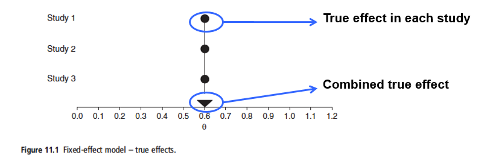
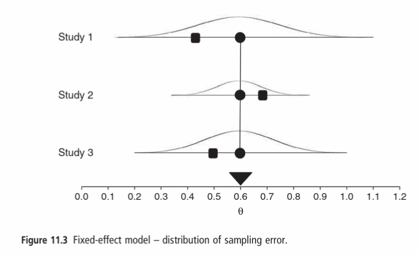
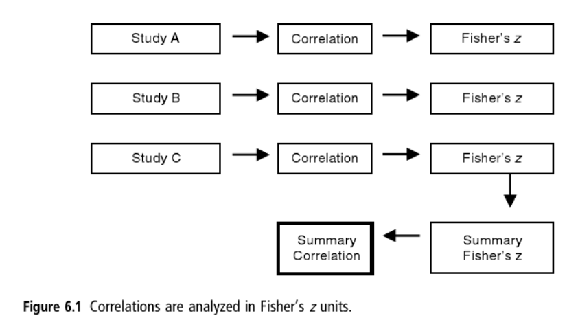

```{r setup, include=FALSE}
library(knitr)
library(learnr)
library(metafor)
continuous_dat <- read.csv("www/Borenstein_p88.csv")
binary_dat     <- read.csv("www/Borenstein_p93.csv")
corr_dat       <- read.csv("www/Borenstein_p98.csv")

knitr::opts_chunk$set(echo = FALSE)
```


## Introduction
In [the previous website](https://naturalandenvironmentalscience.shinyapps.io/Further_Effects/) we explored how to calculate effect sizes using R as a 'hand-calculator', and then undertake a simple fixed-effect meta-analysis using R with Hedges' _g_ as our measure of the standardised mean difference between two treatments. The disadvantage of this approach is that it is very time-consuming. Fortunately, the `metafor` package automates many of the steps, making the process much easier. Here we will go through fixed- and random-effects meta-analysis with continuous data, and display the results in forest plots. We will also consider binary (count) and correlation data.

## Revision: Fixed-effects
Recall that these data can be analysed by [either fixed- or random-effects](https://naturalandenvironmentalscience.shinyapps.io/Further_Effects/#section-fixed--vs-random-effects) meta-analysis, and the approach and philosophy differs slightly. The following diagram summarises a fixed-effect model

{Width=75%}

In the above diagram our effect size is represented by $\theta$ (Greek letter theta), with our true overall effect across all studies the triangle at the bottom. The basic assumption of a fixed-effect model is that every study would have this same true effect, as shown by the circles lined up vertically.

Since all the studies have the **same** true effect, any variation that they report must be due to random error inherent in each study. If you had infinite sample sizes, they would all report the same true effect; they would be showing the population-based effect size. See [populations and samples](https://naturalandenvironmentalscience.shinyapps.io/Effectsizes/#section-populations-and-samples). This is summarised below:

{Width=75%}

Of course, in reality the sample size in each study is not infinite, so you get sampling variation. In the diagram below the true effect for each study (circles) is still the same, but the observed effect (squares) now varies:

{Width=75%}

So we can say the observed effect $Y$ for study $i$ is:

$$Y_i=\theta+\epsilon_i$$

At first sight, these errors shown as $\epsilon_1, \epsilon_2, \epsilon_3$ (Greek letter epsilon) for the three studies is problemmatic. However, we can estimate the **sampling distribution** around these errors, placing a normal (Gaussian or 'bell-shaped') curve around each error, based on the reported variance in the study.

{Width=75%}

Study 1 has a relatively small sample size, with large variance, so the observed effect could have fallen roughly between 0.20 and 1.00. In contrast, Study 3 has a large sample size, with small variance, and so the observed effect is roughly between 0.40 to 0.80. A normal curve is based on the square root of the variance.

## Fixed-effect meta-analysis; continuous data
### Example dataset
We will use the same example that you worked on earlier, from Borenstein page 88, where you have the means, standard deviations, and numbers of replicates for two treatments (1 and 2):

```{r}
kable(continuous_dat)
```

### Fixed-effect analysis of continuous data
The `escalc()` function can be used to calculate our effect sizes based on this continuous dataset. It can take numerous different, and different numbers of, "arguments" depending on what you are wanting to do and the data available. Here we are giving it:

* `measure`. This is the effect size to calculate. "SMD" represents standardised mean differences as calculated to Hedges' _g_
* `m1i`, `m2i`. The means for the two treatments
* `sd1i`, `sd2i`. The standard deviations
* `n1i`, `n2i`. The number of replicates
* `data`. The name of the data.frame; each row is a separate study.

In the code-block below, your data are called `continuous_dat`

```{r fixed_effect_size, exercise=TRUE}
continuous_eff <- escalc(measure="SMD", m1i=T_mean, sd1i=T_SD, n1i=T_n,
                         m2i=C_mean, sd2i=C_SD, n2i=C_n, data=continuous_dat)
summary(continuous_eff)

```

In the output summary, you the column headed `yi` contains the Hedges' _g_ standardised effect sizes, and the column `vi` their within-variance. Compare these values with those you manually calcaluated before; they are the same, but you can see that it is much simpler via `metafor`. Also output are standard errors, z test statistics and the lower and upper 95% confidence intervals. Now you can complete the meta-analysis via the `rma` command. Here we provide it with four arguments:

* `yi` The effect size. We are using Hedges' _g_ here, but the `rma` function always assumes that `yi` is your effect size.
* `vi` Within-study variance
* `data` The dataframe with the effect sizes and variances. There is nothing wrong if in the `escalc` call you decide to "overwrite" your original dataframe; it will keep all the existing columns, and add the new ones to it.
* `method`. By default `rma` doesnot do fixed-effects models, so we have to specify it here.

```{r fixed_effect_rma-setup}
continuous_eff <- escalc(measure="SMD", m1i=T_mean, sd1i=T_SD, n1i=T_n,
                         m2i=C_mean, sd2i=C_SD, n2i=C_n, data=continuous_dat)
```

```{r fixed_effect_rma, exercise=TRUE}
continuous_fixed_rma <- rma(yi, vi, data=continuous_eff, method="FE")
summary(continuous_fixed_rma)

```

This shows the standardised mean difference (Hedges _g_) of 0.4150021 under the estimate heading, the same as the value of M that you manually calculated before. It also shows the standard error, the z-statistic, p-value and 95% CI. Here the meta-analysis is indicating a significant difference between the treatment and control for the reported standardised effect size.

Finally, you can summarise all these results via a ‘forest plot’; we will use the `showweights` option to display them:

```{r fixed_forest-setup}
continuous_eff <- escalc(measure="SMD", m1i=T_mean, sd1i=T_SD, n1i=T_n,
                         m2i=C_mean, sd2i=C_SD, n2i=C_n, data=continuous_dat)
continuous_fixed_rma <- rma(yi, vi, data=continuous_eff, method="FE")
```

```{r fixed_forest, exercise=TRUE}
forest(continuous_fixed_rma, showweights = TRUE)

```

The standard output shows the effect size at the end, and the 95% CI for each study as well as for the overall fixed-effects (FE) model. By default, the forest plot merely lists the studies as ‘Study 1’, ‘Study 2’ etc., but later you will learn R commands to improve the plots.

## Revision: Random-effects
One problem with the fixed-effect method is that it assumes that all the studies are identical, and that the real effect size is the same in all the studies. Of course in reality this is unlikely to be true. The underlying effect sizes are likely to differ. So our underlying true effects will differ for each study, forming a bell-shaped curve around our overall true effect across all studies:

{Width=75%}

In the above diagram $\mu$ (Greek letter mu) effect size, and the triangle represents the overall true effect across all studies. The actual true effect at three studies within this bell-shaped curve are represented by circles.

For example, survival of an endangered mammal population as a result of a management intervention may partly depend on the age of the mammals in the different populations in each of the different studies, as well as the actual management intervention. The diagram below shows the true effect sizes (0.55, 0.65 and 0.50) in three studies, assuming no observation error whatsoever, $\delta_1$, $\delta_2$ and $\delta_3$. The curve represents the normal distribution around all true effects.

{Width=75%}

Of course in reality, there is observation error, so for our third study there is both the sampling error, shown as $\epsilon_3$ below which is the difference of what was observed, $Y_3$ and the true effect size $\delta_3$ in that study. The study effect size differs from the overall effect size for all studies by $\zeta_3$ as shown below:

{Width=75%}

So, we can say that the observed effect $Y_i$ for any study is given by the grand mean $\mu$ (Greek letter _mu_), the deviation of the study's true effect from the grand mean $\zeta_i$ (Greek letter _zeta_), and the sampling error in that study $\epsilon_i$ (Greek letter _epsilon_):

$$Y_i = \mu + \zeta_i + \epsilon_i$$
This equation covers both within-study variation $\epsilon_i$ and between-study variation $\zeta_i$. Hopefully you can see that **random-effects models are generally preferred** over fixed-effects models in meta-analysis as they give a more realistic reflection of the processes actually taking place.

## Random-effect meta-analysis; continuous data
The `metafor` package defaults to random models when possible, as they are usually more robust for the reasons explained above. Repeating our analysis as before. There is no difference in the calculation of the effect sizes, so we can use the ones from earlier:

```{r continuous_random_rma-setup}
continuous_eff <- escalc(measure="SMD", m1i=T_mean, sd1i=T_SD, n1i=T_n,
                         m2i=C_mean, sd2i=C_SD, n2i=C_n, data=continuous_dat)
```

```{r continuous_random_rma, exercise=TRUE}
continuous_random_rma <- rma(yi, vi, data=continuous_eff)
summary(continuous_random_rma)

```

Notice that our estimate of the standardised effect size, 0.3606525 is smaller than that obtained via the fixed-effect model of 0.4150021, but is still significant. Again we can produce a forest plot to summarise your findings:

```{r random_forest-setup}
continuous_eff <- escalc(measure="SMD", m1i=T_mean, sd1i=T_SD, n1i=T_n,
                         m2i=C_mean, sd2i=C_SD, n2i=C_n, data=continuous_dat)
continuous_random_rma <- rma(yi, vi, data=continuous_eff)

```

```{r random_forest, exercise=TRUE}
forest(continuous_random_rma, showweights = TRUE)

```

Note how the weighting for Study 4 has gone down compared to the fixed-effect model. It has been downweighted as its reported effect size was so different from all the other studies.

### Response ratio
You may recall that another common effect size when you have continuous quantitative variables as your response are **response ratios**. See [this interactive website](https://naturalandenvironmentalscience.shinyapps.io/Further_Effects/#section-effect-sizes-for-continuous-data) for a reminder. It is basically the ratio of the two means, but log-transformed to maintain symmetry:

$$ln(RR)=\frac{\bar{X_1}}{\bar{X_2}}$$

You can calculate response ratios, column `yi`, using the `method="ROM"` option, standing for 'ratio of means' to `escalc()`.

```{r random_effect_RR, exercise=TRUE}
continuous_eff_RR <- escalc(measure="ROM", m1i=T_mean, sd1i=T_SD, n1i=T_n,
                         m2i=C_mean, sd2i=C_SD, n2i=C_n, data=continuous_dat)

summary(continuous_eff_RR)
```

The `escalc` function automatically applies a natural logarithm transformation, so if you want to see the effect size data (column `yi`) in the original units you need to back-transform via the exponential:

```{r random_effect_RR_exp, exercise=TRUE}
continuous_eff_RR <- escalc(measure="ROM", m1i=T_mean, sd1i=T_SD, n1i=T_n,
                         m2i=C_mean, sd2i=C_SD, n2i=C_n, data=continuous_dat)

summary(continuous_eff_RR, transf=exp)
```

The log units are actually used in the meta-analysis, and are displayed by default unless specified. The log-transformed ones displayed in the forest plot:

```{r random_effect_RR_rma-setup}
continuous_eff_RR <- escalc(measure="ROM", m1i=T_mean, sd1i=T_SD, n1i=T_n,
                         m2i=C_mean, sd2i=C_SD, n2i=C_n, data=continuous_dat)
```

```{r random_effect_RR_rma, exercise=TRUE}
continuous_RR_rma <- rma(yi, vi, data=continuous_eff_RR)
summary(continuous_RR_rma)

# If you want overall meta-analysis effect displayed in original units
# summary(continuous_RR_rma, transf=exp)

forest(continuous_RR_rma, showweights = TRUE)
```

## Fixed-effect meta-analysis; binary data
### Example dataset
Often studies will report binary data, such as ‘dead’ or ‘alive’, ‘present’ or ‘absent’ etc. in ecological and conservation surveys. These are generally analysed as ‘odds ratios’ although metafor can handle ‘risk ratios’ etc. should you wish to use them.

Again these data are taken from Borenstein (page 93) so if you want to do all the calculations by hand you can see the fully-worked out examples and are stored in a dataframe called `binary_dat`

```{r}
knitr::kable(binary_dat)
```

The 'E' represent 'Events' and the 'NE' represent 'Non-events' for the Treatment (T) and Control (C), whilst n is the number of observations in the treatment or control of each study.  The odds ratio is calculated as:

$$OddsRatio = \frac{TreatmentOdds}{ControlOdds}$$

so for the first study, by Saint, this can be calculated as:

$$OddsRatio_1 = \frac{12 \times 14}{53 \times 16} =0.6934$$

Again, the calculations of effect sizes are actually done on the natural logarithm of the effect sizes, i.e. 

$$logOddsRatio=ln(OddsRatio)$$

so if you want to look at the odds ratio in the original units you have to back-transform via the exponential function:

```{r binary_fixed_effect_sizes, exercise=TRUE}
binary_eff <- escalc(measure="OR", ai=E_T, bi=NE_T, ci=E_C, di=NE_C,
                     data=binary_dat)

# Show the effect size in column yi in log-transformed and original units
summary(binary_eff)
summary(binary_eff, transf=exp)
```

The summary results are shown twice here. First the odds ratios (yi column) are by default shown in natural logarithms (ln). To display in their original units we need to anti-log them, which for natural logarithms is via exponential function. You will see the odds ratio for the Saint study displayed as 0.6934 which is the same as obtained manually.

By default on binary data `metafor` uses random-effects as that gives better results and is to be preferred. However, as it is easier to compare the calculations with those you have done by hand, we will initially do a simple fixed-effect model for which we must specify that `method="FE"` as one of the options. By default for odds ratios the forest plot are shown in log scale, so back-transform (compare this plot with Fig. 14.3 of Borenstein)

```{r binary_fixed-setup}
binary_eff <- escalc(measure="OR", ai=E_T, bi=NE_T, ci=E_C, di=NE_C,
                     data=binary_dat)

```

```{r binary_fixed, exercise=TRUE}
binary_fixed_rma <- rma(yi, vi, data=binary_eff, method="FE", measure="OR")
summary(binary_fixed_rma) # use transf=exp for original units

forest(binary_fixed_rma, atransf=exp, showweights = TRUE)
```

The summary table gives the estimate of the effect size as -0.7241 which is the log odds ratio. To convert it back to the original odds ratio (OR) scale take its exponential using the `exp` function to get 0.4847

## Random-effect meta-analysis; binary data
As you have already seen, it is **much better** to do random effects meta-analysis. The method is very similar for random-effects, but now use the `rma` function defaults to random-effects unless otherwise specified:

```{r binary_random-setup}
binary_eff <- escalc(measure="OR", ai=E_T, bi=NE_T, ci=E_C, di=NE_C,
                     data=binary_dat)

```

```{r binary_random, exercise=TRUE}
binary_random_rma <- rma(yi, vi, data=binary_eff)

summary(binary_random_rma)
forest(binary_random_rma, atransf=exp, showweights = TRUE)

```

Compare the two forest plots for the fixed vs random effects: here you can see that by taking the random differences between the studies into account, that the effect size is slightly larger 0.56 in the RE than the 0.48 in the FE study.

### Risk ratios
You will recall that instead of odds ratios, risk ratios are also popular with binary data. In some ways they are easier to interpret. So we will complete our exploration of binary data with risk ratios.

We have already looked at an example of **risk ratios** [in this website](https://naturalandenvironmentalscience.shinyapps.io/Effectsizes/#section-interactive-forest-plot-of-meta-analysis) and in ecological and conservation surveys if you are particularly interested in the risk of extinction for example, then these might be an appropriate measure.

As usual when dealing with ratios, it is better to transform the ratios to natural logs to maintain symmetry, and back-transform where needed. First we can calculate the effect size, using `method="RR"`:

```{r binary_risk_ratios, exercise=TRUE}
binary_eff_riskratio <- escalc(measure="RR", ai=E_T, bi=NE_T, ci=E_C, di=NE_C,
                     data=binary_dat)

# Effect sizes in log-transformed and back-transformed units
summary(binary_eff_riskratio)
summary(binary_eff_riskratio, transf=exp)
```

The meta-analysis can then be performed in the usual way, where it defaults to a random-effects model.

```{r binary_riskratio-setup}
binary_eff_riskratio <- escalc(measure="RR", ai=E_T, bi=NE_T, ci=E_C, di=NE_C,
                     data=binary_dat)

```


```{r binary_riskratio, exercise=TRUE}
binary_riskratio_rma <- rma(yi, vi, data=binary_eff_riskratio)


summary(binary_riskratio_rma)
forest(binary_riskratio_rma, atransf=exp, showweights = TRUE)
```

Many ecologists find risk ratios more intuitive and easier to understand than odds ratios.

### Risk differences
We did briefly discuss these; they are available through the `method="RD"` option but are less widely used.

## Fixed-effect meta-analysis; correlation data
### Fisher's z scores
Most ecologists are very familiar with correlation, as it is a relatively simple statistic, widely reported. The "population" correlation is usually represented by the Greek letter $\rho$ (Greek letter _rho_) whilst the "sample" correlation, that is what is actually reported in any study, is indicated via _r_.   However, in meta-analysis the correlation coefficients _r_ are usually converted to Fisher's _z_ scale (the terminology is a little confusing, as this is not the same as the _z_ values used in some statistics tests). The values are then back-converted to the original _r_ values for final presentation of the meta-analysis results. The process is shown schematically below:

{Width=75%}

and Fisher's _z_ scale values can be calculated as:

$$z=0.5 \times \ln\bigg(\frac{1+r}{1-r}\bigg)$$

and the back-transformation to the original correlation units is:

$$r=\frac{e^{2z}-1}{e^{2z}+1}$$

Again we will use one of the example datasets from Borenstein, so that if you want to undertake the entire analysis by hand to gain greater insights you a free to do so. Here are the data you will analyse, stored in a dataframe `corr_dat`:

```{r}
knitr::kable(corr_dat)
```

There are six studies; Let's focus on the first study by Fonda first. To calculate Fisher's _z_ transformed value for this study, we simply need to calculate:

$$z_1 = 0.5 \times \ln\bigg(\frac{1+0.50}{1-0.50}\bigg)$$

which can be calculated in R; note that in R the function "`log`" is for natural logs, whereas the function "`log10`" is for logs to base-10:

```{r z_value_Fonda, exercise=TRUE}
z_Fonda <- 0.5 * log((1+corr_dat$Correlation[1])/(1-corr_dat$Correlation[1]))

z_Fonda
```
Again it is relatively simple to calculate the values for all the studies using the `escalc` function from `metafor`. The inputs are:

* `ri` The correlation coefficient in each study
* `ni` the number of samples in the study
* `data` The dataframe containing the correlation dataset
* `measure` Here we define it as `"ZCOR"` to convert _r_ to Fisher's _z_ values

The code below allows you to see the difference between the _z_ data, or when back-transformed in the `summary()` function using the `transf.ztor` option.

```{r correlation_effect, exercise=TRUE}
corr_eff <- escalc(ri=Correlation, ni=N, data=corr_dat, measure="ZCOR")

summary(corr_eff)
summary(corr_eff, transf=transf.ztor)
```

The two output tables are basically the same, but in the second the Fisher's _z_ scores, shown in the `yi` column, have been back-transformed to the original correlation.  However, you can see that the _z_ value for the Fonda study matches that which you calculated manually earlier.

To undertake a fixed-effects analysis of the correlations, to find out whether there really is a positive (or negative) correlation across all the studies:

```{r correlation_fixed-setup}
corr_eff <- escalc(ri=Correlation, ni=N, data=corr_dat, measure="ZCOR")

```

```{r correlation_fixed, exercise=TRUE}
corr_fixed_rma <- rma(yi, vi, data=corr_eff, method="FE")

summary(corr_fixed_rma)
forest(corr_fixed_rma, atransf=transf.ztor, showweights =TRUE)
```


## Random-effect meta-analysis; correlation data
Remember that in random-effects analysis we are looking at both the within-study and the between study variance in the calculations. As usual the `rma` function defaults to the random-effects model so we simply need to omit the `method="FE"` option:

```{r correlation_random-setup}
corr_eff <- escalc(ri=Correlation, ni=N, data=corr_dat, measure="ZCOR")

```

```{r correlation_random, exercise=TRUE}
corr_random_rma <- rma(yi, vi, data=corr_eff)

summary(corr_random_rma)
forest(corr_random_rma, atransf=transf.ztor, showweights=TRUE)

```

Again, you will probably find the random-effects model is more appropriate for most of the studies that you are likely to encounter in ecology and conservation.


## Checking the quality of your models
A simple method to check that your meta-analysis models have met the underlying assumptions (e.g. whether a random-effects model is appropriate etc.) is to plot the results of the model as a quantile-quantile or "QQ" plot. If you need a reminder of QQ plots, [see this web-page where QQ plots are described](https://naturalandenvironmentalscience.shinyapps.io/linear_explan/#section-checking-model-assumptions). In essence, these rank the standardised residuals from your models and plot them against those that would have been expected if all the assumptions had been met.  The closer the points are to a straight line, within the error bars, the better the model.  Let's plot the fixed- and random- effects QQ plots for the continuous data meta-analyses:

```{r qqnorm_plots-setup}
continuous_eff <- escalc(measure="SMD", m1i=T_mean, sd1i=T_SD, n1i=T_n,
                         m2i=C_mean, sd2i=C_SD, n2i=C_n, data=continuous_dat)
continuous_fixed_rma <- rma(yi, vi, data=continuous_eff, method="FE")
continuous_random_rma <- rma(yi, vi, data=continuous_eff)

```


```{r qqnorm_plots, exercise=TRUE}
qqnorm(continuous_fixed_rma, main="Fixed normal QQ plot")
qqnorm(continuous_random_rma, main="Random normal QQ plot")
```

You can see that more of the points for the random-effects model are within the 95% confidence intervals which therefore looks a better model. Go back to previous pages on the website to create similar plots for the binary and correlation data to see whether the fixed- or random-effects approaches look better.

